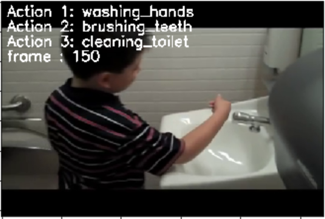

# Panorama Hand Washing Example

This is an end to end example that shows how to use an action detection model to detect Hand Washing and time it.

## Files Included
- Lambda (Folder)
	- classes.py 
	- HandWashDetection.py
	- HandWashingLambda.zip
- Notebook(Folder)
	- HandWash-Panorama-Examples.ipynb

washing_hands.mp4 (Video to test)
resnet101_v1b_kinetics400.tar.gz (Model to Use)

### Use Case
- Detect Hand Washing using the resnet101_v1b_kinetics400 action detection model. 
- Once the action is detected, we start a timer that counts backwards to 120 seconds. 
- If the person in frame maintains the same action for 120 seconds, we print a congratulatory message
- If not, we ask them to keep washing their hands

### How to use the Notebook
The included Jupyter Notebook gives a helpful introduction of 
- Task at hand 
- Step by step walk thru of the MXNet code
- Understanding the Lambda structure by creating code in the same format
- Creating a Lambda function by uploading the included Lambda zip file
- Publishing the Lambda and displaying the version number and the Lambda console link

### Example Output From Notebook

The output displays the top 3 actions detected on the screen. 

### How to use the Lambda Function

The included Lambda function is a zip file that can be directly uploaded to the Lambda console to create a usable Lambda arn. 

### Other resources to use

- [AWS Panorama Documentation](https://docs.aws.amazon.com/panorama/)
