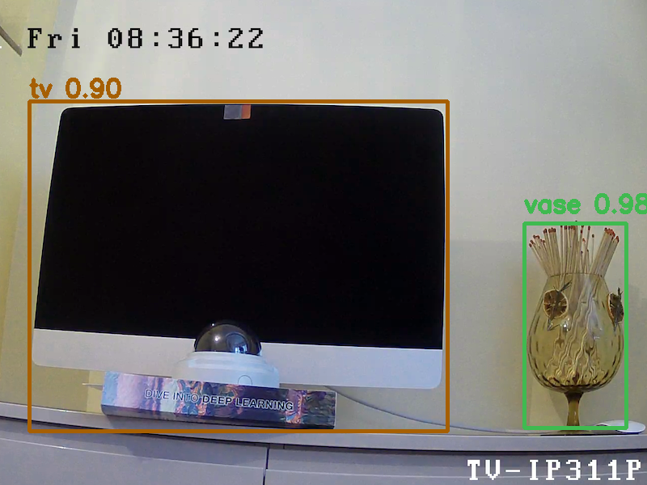

# AWS Panorama Object Detection with YOLOv5 Example

This is an end to end example that shows how to deploy a YOLOv5 machine learning model, pre-trained with MS COCO dataset using PyTorch, to a Panorama appliance.

## Files Included

- utils.py
- yolov5s_lambda.py
- yolov5s.ipynb
- test.png
- test-result.png

### Use Case

- Build a custom object detector using a pre-trained model using PyTorch
- First step towards training your own PyTorch trained object detection model with YOLO

### How to use the Notebook

The included Jupyter Notebook gives a guided tour of deploying a pre-trained YOLOv5 ML model. Follow the step by step instructions in the Notebook to deploy the provided model and Application code to the Panorama appliance

### Example Output From Notebook

An example output display is shown here

### How to use the Lambda Function

Notebook has all the code necessary to pack the included Lambda function into a zip file and deploy it. Alternatively, that zip file can be directly uploaded to the Lambda console to create a Lambda. 

### Other resources to use

- [AWS Panorama Documentation](https://docs.aws.amazon.com/panorama/)
- [Transfer learning](https://github.com/ultralytics/yolov5/issues/1314)