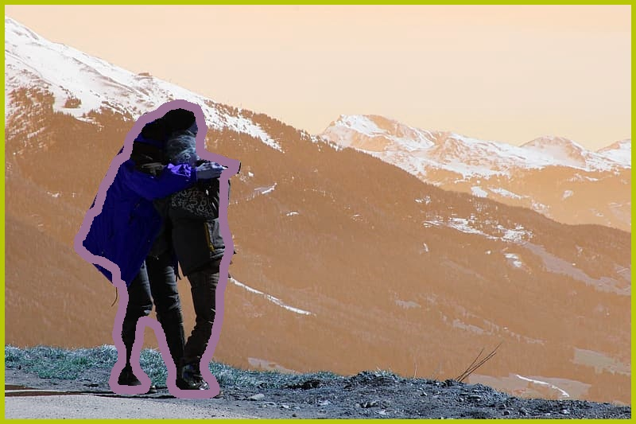

# Panorama Semantic Segmentation Example

This is an end to end example that shows how to use a semantic segmentation model to segment the image into its respective classes.

## Files Included
- Lambda (Folder)
	- segmentation.py
	- segmentation.zip
- Notebook(Folder)
	- Semantic-Segmentation-Panorama-Example.ipynb
    - persons.jpg
    - persons2.jpg

- persons-segmentation.jpg (Example output)
- fcn_resnet101_voc.tar.gz (Model to Use)

### Use Case
- Generate segmentation boundaries for classes detected using fcn_resnet101_voc model. 
- The model will be able to "understand" what the objects are in the image and differentiate it from the background

### How to use the Notebook
The included Jupyter Notebook gives a helpful introduction of 
- Task at hand 
- Step by step walk thru of the MXNet code
- Understanding the Lambda structure by creating code in the same format
- Creating a Lambda function by uploading the included Lambda zip file
- Publishing the Lambda and displaying the version number and the Lambda console link

### Example Output From Notebook

The output displays an image with boundaries around each class it detects.

### How to use the Lambda Function

The included Lambda function is a zip file that can be directly uploaded to the Lambda console to create a usable Lambda arn. 

### Other resources to use

- [AWS Panorama Documentation](https://docs.aws.amazon.com/panorama/)
