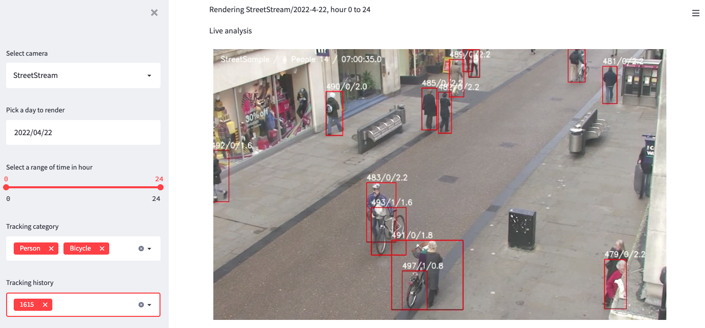

# Multi Object Tracking using YOLOX + BYTE-TRACK and data analysis
<div align="center"></div>
<div align="center"></div>

## Brief 
In this sample, you'll learn how to build MOT platform on AWS.

Technical details are below
* Bring pre-trained YOLOX model(detection of people, bicycle, car etc.. by use of COCO dataset) into panorama using sagemaker neo compilation
* Show how to incorporate BYTE-TRACK(multiobject tracking algorithm) with YOLOX and bring output to kinesis firehose for data analysis
* Show how to stream produced video on panorama into kinesis video by use of opencv and gstreamer
* Sample dashboard using streamlit platform to see heatmap and history of object movement(such as maximum stay time at a given spot per hour) and realtime video which produced on panorama

## Architecture
<div align="center"></div>

## Steps for setting
To deploy solution, you need to finish following steps
* 1. Deploy prerequisite services on AWS
* 2. Deploy application on panorama appliance
* 3. Deploy dashboard on local machine(or EC2) for visualization and analysis

Before proceed, determine which region to use.
As of now, Panorama can be deployed limited regions but the data produced in device can be pushed to any regions.
In this document, the region is where the location of storing data which can be differ from deployed region of Panorama appliance.

### 1. Deploy prerequisite services on AWS
#### (Optional for Kinesis Video) Create IAM user and accesskey/secretkey for Kinesis Video access
```
1. Open IAM console
2. Create new IAM User with accesskey - programming access option
3. Use exist policy and select AmazonKinesisVideoStreamsFullAccess option
4. Record AccessKey and SecretKey 
```

#### (Optional for Kinesis Video) Create new secret from Secrets Manager to store accesskey/secretkey
```
1. Open Secrets Manager console
2. Click 'Store a new secret'
3. Choose Other type of secret
4. add following pairs to Key/value
    accesskey    Recorded-AccessKey
    secretkey    Recorded-SecretKey
5. Encryption key: aws/secretsmanager
6. Save secret with Secret name: KVSSecret
```

#### (Optional for Kinesis Video) Create new Kinesis Video Stream
```
1. Open Kinesis Video Streams console
2. Click 'Create video stream'
3. Video stream name: panorama_preview
```

#### Create new S3 bucket for storing tracking data
```
1. Open S3 console
2. Create new bucket: mot-analysis-{accountid}
```

#### Create new Kinesis Firehose for receiving data from appliances and use following options
```
1. Open Kinesis Firehose console
2. Click Create delivery stream and use below option
3. Source: Direct PUT
4. Destination: Amazon S3
5. Delivery stream name: panorama_mot_analysis
6. S3 bucket: mot-analysis-{accountid}
7. Dynamic partitioning: Enabled
8. Multi record deaggregation: Enabled
9. Multi record deaggregation type: JSON
10. New line delimiter: Enabled
11. Inline parsing for JSON: Enabled
12. Dynamic partitioning keys -> Key name: camera / JQ expression: .sid
13. S3 bucket prefix: heatmap/camera=!{partitionKeyFromQuery:camera}/year=!{timestamp:yyyy}/month=!{timestamp:MM}/day=!{timestamp:dd}/hour=!{timestamp:HH}/
14. S3 bucket error output prefix: error-data/!{firehose:error-output-type}/year=!{timestamp:yyyy}/month=!{timestamp:MM}/day=!{timestamp:dd}/hour=!{timestamp:HH}/
```

### 2. Deploy application to panorama appliance
```
1. Create role through IAM console using Panorama use case and add following permissions
    * AmazonS3FullAccess
    * SecretsManagerReadWrite
    * AmazonKinesisVideoStreamsFullAccess
    * AmazonKinesisFirehoseFullAccess
2. Open ./mot_analysis_app/graphs/mot_analysis_app/graph.json
3. Modify following config values by your environment
    * source_fps: Source camera FPS, sample video inside simulator is 25 FPS
    * gstreamer_encoder: Set empty string if you don't need KVS feature
    * service_region: aws region to host data
    * bucket_name: mot-analysis-{accountid}
4. (Optional) Run simulator_setup.sh inside the simulator to install required packages for testing sample before deploy.
    * Installing additional libraries into the simulator only requires for modifying and testing the code
    * The script tested on provided ARM based simulator but it will work on other types.
    * Check application log using 'tail -f /opt/aws/panorama/logs/app.log' from jupyter cli console
5. Open mot_analysis.ipynb to test and deploy this sample
6. Open S3 bucket and Kinesis Video preview to check presence of data. You'll need at least 5 minutes to get data from Kinesis Firehose to S3.
    * In case of initial loading, it takes usually 30 minutes for receiving first data
    * Check S3 folder to confirm application deployed and running
    * 'dailycapture' folder indicates captured daily image from each camera for rendering heatmap
    * 'heatmap' folder indicates object movement data to render heatmap and tracking analysis
```

### 3. Deploy dashboard on local machine(or EC2) for visualization and analysis
```
1. Open Glue Crawler console
2. Click Add crawler and use following options (Use default other than below)
    * Crawler name: mot_analysis
    * Data store: S3
    * Include path: s3://mot-analysis-{accountid}/heatmap
    * Create an IAM role if you don't have proper one
    * Schedule Frequency: Custom(Runs every 5 min past the hour), Cron expression: 05 0/1 * * ? *
    * Output Database: default
    * Check option 'Update all new and existing partitions with metadata from the table'
3. Download files in ./dashboard to local machine or EC2 to host dashboard.
    * (Optional)'aws configure' to set proper credential (S3 read/list, KVS read, Athena read required)
    * RUN 'pip install boto3 awswrangler streamlit streamlit-autorefresh streamlit_img_label matplotlib numpy pandas pascal_voc_writer scikit-image' to install required packages for running dashboard
    * Open mot_analysis.py and set proper value of BUCKET_NAME to mot-analysis-{accountid}
    * RUN 'streamlit run mot_analysis.py --server.port 80' to launch dashboard
    * Newly created S3 folder partitions(eg, hourly, new camera and so on) between crawler schedules will not visible via athena until next schedule. Click 'Clear cache and refresh database' button to update partitions if you are one of the situation or wait till next schedule.
4. Do analysis using interactive dashboard.
    * Left pane shows list of cameras connected to appliance and date to check history and category of objects. Tracking history shows top 10 long stay object IDs.
    * Right pane shows live analysis video from appliance. As of now it shows only first camera
    * Heatmap shows objects history by given date with timerange.
    * When 'Tracking history' selected from left pane, the map shows each objects trajectory.
    * Click 'Add bounding box' to do spot analysis. First graph shows how many object passed the box. Second shows maximum stay time by single object.
    * Bottom wide graph shows maximum people count in a single shot by time.
```

### Appendix
* https://towardsdatascience.com/deploy-an-object-detector-model-at-the-edge-on-aws-panorama-9b80ea1dd03a
* https://github.com/ifzhang/ByteTrack