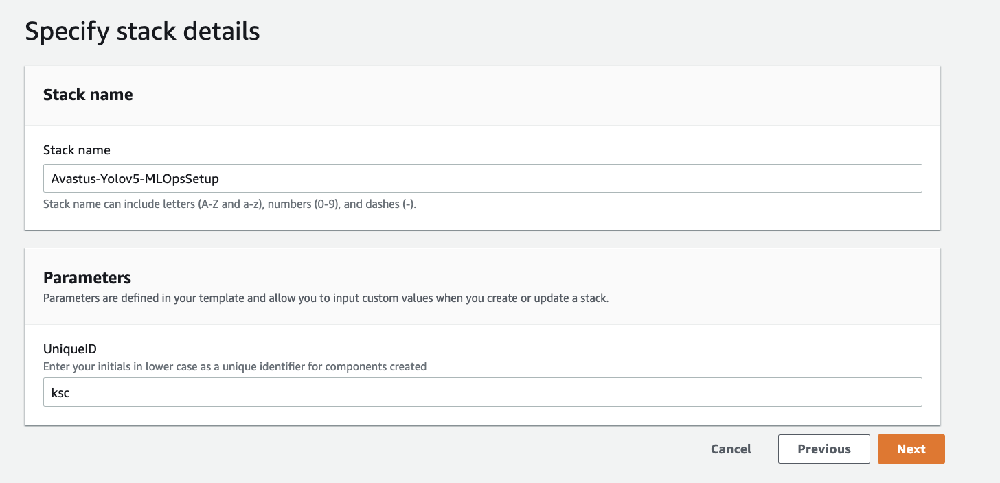
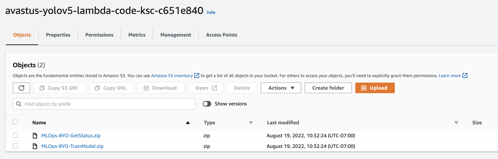
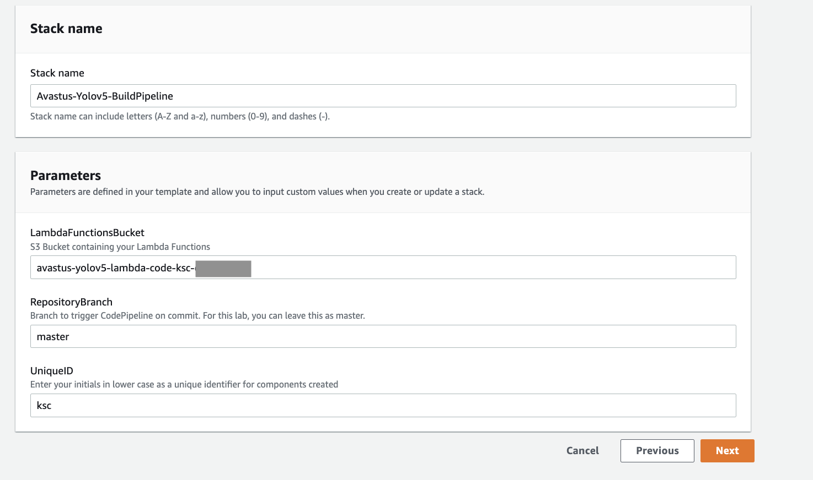
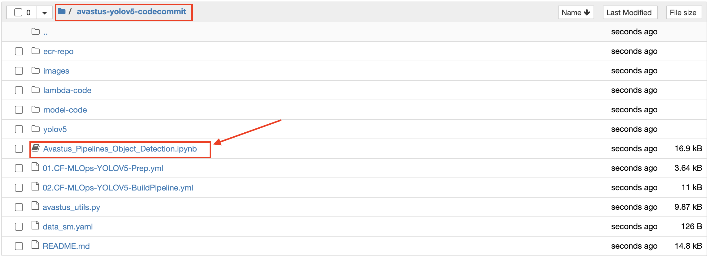
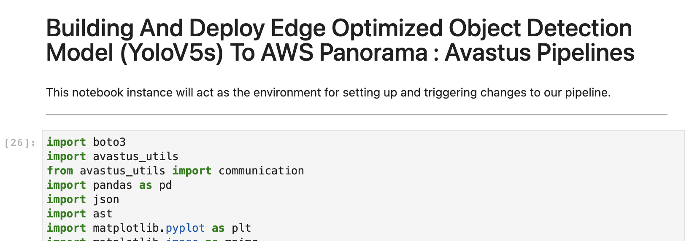

# MLOps : Automatically Build An Object Detection Model (YoloV5s) Using AWS SageMaker Ground Truth, AWS Sagemaker and AWS Code Pipelines

This is an MLOps pipeline, that once set up will consistently build a Custom Object Detection Model using YoloV5s

* Takes in as input an AWS SageMaker Ground Truth job manifest file
* The pipeline automatically converts this into Yolov5s input format
* The pipeline then builds the ECR image for Sagemaker Training
* The training job is then kicked off with the data that is created

-------
## Prerequisite

1) AWS Account & Administrator Access
2) Please use North Virginia, **us-east-1** for this workshop

------

## MLOps Overview

This MLOps pipeline builds a YoloV5s model with Ground Truth manifest file as an input. We will package the code into a source control repository, [AWS CodeCommit](https://aws.amazon.com/codecommit/), for version control.  

This ML Ops pipeline will

• Setup a base pipeline responsible for building a YoloV5s Object Detection model

•	Create logic, in this case Lambda functions, to execute the necessary steps within the orchestrated pipeline required to build and train CV models in an end-to-end pipeline

For this pipeline, we will use the steps outlined in this document combined with two [CloudFormation](https://aws.amazon.com/cloudformation/) templates to create your pipeline.   CloudFormation is an AWS service that allows you to model your entire infrastructure using YAML/JSON templates.   The use of CloudFormation is included not only for  simplicity in lab setup but also to demonstrate the capabilities and benefits of Infrastructure-as-Code(IAC) and Configuration-as-Code(CAC).  We will also utilize SageMaker Notebook Instances to ensure a consistent experience.

## **IMPORTANT:  There are steps in this pipeline that assume you are using N.Virginia (us-east-1).  Please use us-east-1 for this pipeline for now** 

---

## Step 1: MLOps Preparation 

In this step, you will launch a CloudFormation template using the file 01.CF-MLOps-YOLOV5-Prep.yml provided as part of workshop materials.  This CloudFormation template accepts a single input parameter, **your-initials**,  that will be used to setup base components including:

-	**CodeCommit Repository:** CodeCommit repository that will act as our source code repository containing assets required for building our custom docker image.

-	**S3 Bucket for Lambda Function Code:** S3 bucket that we will use to stage Lambda function code that will be deployed by a secondary CloudFormation template executed in a later step.

-  **SageMaker Notebook Instance:**  We will use a SageMaker Notebook Instance as a local development environment to ensure a consistent lab environment experience. 

### Steps:

To launch the setup of the resources above using CloudFormation:

1) Download this git repository by either cloning the repository or downloading the *zip

2) Login to the [AWS Console](https://https://console.aws.amazon.com/) and enter your credentials

3) Under **Services**, select [CloudFormation](https://console.aws.amazon.com/cloudformation)

4) Click **Create Stack** buttton

5) Under **Select Template**:
    * Click radio button next to 'Upload a template to Amazon S3', then click **Browse...**

    * From the local repository cloned to your machine in step 1, select the file called ./01.CF-MLOps-BYO-Lab-Prep.yml

    * Click **Open**

6) Under **Specify Stack Details**, enter: 

   * **Stack Name**: Avastus-Yolov5-MLOpsSetup

   *  **UniqueID**: Enter *yourinitials* in lower case (Example: jdd)
   
      **IMPORTANT: Use a 3-character initial as shown above**

   

7) Click **Next**

8) Under **Options**, leave all defaults and click '**Next**'

9) Under **Review**, scroll to the bottom and check the checkbox acknowledging that CloudFormation might create IAM resources and custom names, then click **Create**

10) You will be returned to the CloudFormation console and will see your stack status '**CREATE_IN_PROGRESS**'

11) After a few minutes, you will see your stack Status change to '**CREATE_COMPLETE**'.  You're encouraged to go explore the resources created as part of this initial setup. 

---

## Step 2: Upload Lambda Functions to S3

In this step, you will need to upload pre-packaged Lambda functions to S3.  These Lambda functions will be used at various stages in our MLOps pipeline.  Because we will be using CloudFormation and the [AWS Serverless Application Model (SAM)](https://docs.aws.amazon.com/serverless-application-model/latest/developerguide/what-is-sam.html) to deploy the Lambda functions into our accounts, they must be uploaded be packaged and uploaded to S3 prior to executing our next CloudFormation template.  

The descriptions of each Lambda function are included below:

-	**MLOps-BYO-TrainModel.zip:**  This Lambda function is responsible for executing a function that will accept various user parameters from code pipeline (ex. ECR Repository, ECR Image Version, S3 Cleansed Training Data Bucket) and use that information to then setup a training job and train a custom model using SageMaker
-	**MLOps-BYO-GetStatus.zip:** This Lambda function is responsible for checking back in on the status of the previous Lambda function.  Because Lambda has an execution time limit, this function ensures that the status of the previous function is accurately capture before moving on to the next stage in the pipeline

### Steps:

1. Download the contents of this git repository to your local machine by either cloning the repository or downloading the zip file.

2. From the AWS console, go to **Services** and select **S3**

3. Find and click on your bucket created in the previous step (avastus-yolov5-lambda-code-*yourinitials-randomgeneratedID*)

     Example: avastus-yolov5-lambda-code--jdd-9d055090

     **WARNING:** Make sure you are using the correct bucket that was created by the CloudFormation template with the naming standard above.

4. Click **Upload** in the upper left corner to uploaded pre-packaged lambda functions to your bucket

    * Click **Add files** and select all 4 lambda functions from the /lambda-code/MLOps-BYO*.zip directory in this repository that were download/cloned to your local laptop in step #1

    * Click **Next**

    * Accept defaults on remaining prompts selecting **Next** each time until hitting **Upload** on the final screen

You should now see all of your packaged lambda functions stored as object inside your S3 buckets. The CloudFormation template we launch next will pull the objects from this bucket, using SAM, and deploy them to as functions in the [AWS Lambda Service](https://aws.amazon.com/lambda/).   

---

## Step 3: Build the Base MLOps Pipeline

In this step, you will launch a CloudFormation template using the file 02.CF-MLOps-BYO-BuildPipeline.yml provided as part of workshop materials to build out the pipeline we will be using to train and deploy our models.  This CloudFormation template accepts 4 input parameters that will be used to setup base components including:

**IAM Roles:**

-	**SageMaker Execution Role:**  This role will be utilized with our Lambda function code to establish a trusted relationship between a Lambda function and SageMaker.  The role gets created in the CloudFormation template as well as passed as a Environment Variable to the Lambda Function
-	**Lambda Execution Role:** This role will be utilized by all of the Lambda functions created in this lab.  The role provides access to AWS services access by the Lambda functions including S3, SageMaker, CloudWatch, CodePipeline, ECR
-	**CodeBuildRole:** This role will be utilized by CodeBuild to setup a trusted relationship for AWS services include CodeCommit and ECR.

**Pipeline Resources:** 
- **Lambda Functions:**  Lambda functions utilizing the packaged code uploaded to S3 in the above step.  The Lambda function definitions include the code packaged above as well as specifications related to the Lambda function runtime and configuration. 

- **CodeBuild Job:** CodeBuild job that we will utilize to pull code from CodeCommit and build a Docker image that will be stored in ECR

- **Elastic Container Registry (ECR):** Setup a new Elastic Container Registry that will be used source control for docker image 
	
- **S3 Bucket Model Artifacts:** Setup a versioned S3 bucket for model artifacts

- **CodePipeline Pipeline:**  Set up a CodePipeline that utilizes resources built in the CloudFormation template to create and end-to-end pipeline that we will use to build,train,and deploy mode to target environments

### Steps:

1) Login to the [AWS Console](https://https://console.aws.amazon.com/) and enter your credentials

2) Under **Services**, select [CloudFormation](https://console.aws.amazon.com/cloudformation)

3) Click **Create Stack** buttton

4) Under **Select Template**:
    * Click radio button next to 'Upload a template to Amazon S3', then click **Browse...**

    * From the local repository cloned to your machine in step 1, select the file called ./02.CF-MLOps-BYO-BuildPipeline.yml

    * Click **Open**

    * Click **Next**

3. Under **Specify Stack Details**, enter: 

   * **Stack Name**: Avastus-Yolov5-BuildPipeline

   * **LambdaFunctionsBucket**: Enter the name of the existing S3 bucket that contains the lambda code we uploaded in the previous step 

       (i.e. avastus-Yolov5s-lambda-code-*yourinitials-uniqueid*) 

   *  **RepositoryBranch**: master
   *  **UniqueID**: Enter *yourinitials* in lower case (Example: jdd)
   
      **IMPORTANT: Use a 3-character initial as shown above**

   

4. Click **Next**

5. Under **Options**, leave all defaults and click **Next**

6. Under **Review**, scroll to the bottom and check the checkbox acknowledging that CloudFormation might create IAM resources and custom names, then click **Create**

7. You will be returned to the CloudFormation console and will see your stack status '**CREATE_IN_PROGRESS**'

8. After a few minutes, you will see your stack Status change to '**CREATE_COMPLETE**'.  You're encouraged to go explore the resources created as part of this initial setup. 

**NOTE: CodePipeline will automatically kickoff after this step; however, since we have not yet added data to the S3 bucket - it will error on the initial kickoff which is expected. Adding data to the S3 bucket is executed in Step 5 below. **

---
## Step 4: Clone Repository

In this step, we will clone the YoloV5s Avastus repository and also install some dependencies we need

1. Login to the [AWS Console](https://https://console.aws.amazon.com/) and enter your credentials

2. Select **Services** from the top menu, and choose **Amazon SageMaker** 

3. Click on **Notebook Instances**

4. You should see a notebook instance, created by the CloudFormation template, called **Avastus-Yolov5-Notebook-*yourinitials***.  Click **Open Jupyter**

5. From within your Jupyter notebook, click the **New** dropdown in the top right, then select **Terminal** 

6. Once the **Terminal** is launched,

 *Run the following commands in the terminal* 

        git clone -b autocv https://github.com/SuryaKari/aws-panorama-samples.git
        pwd
        ls -la
        mkdir /home/ec2-user/SageMaker/byo-staging
        cp -R /home/ec2-user/SageMaker/aws-panorama-samples/tools/autocv/object_detection/yolov5/* /home/ec2-user/SageMaker/byo-staging/
        sudo rm -r /home/ec2-user/SageMaker/aws-panorama-samples

---
## Step 5: Trigger Pipeline Executions

In this step, you will execute several activities within a SageMaker Notebook Instance to:
   
   1. **Simulate Analytics Pipeline Activities**: Push S3 training and validation data to the S3 data bucket (i.e. mlops-data-*yourinitials-uniqueid*)

   2. **Commit training/inference code to CodeCommit**: Using code from this public git repository (./model-code), commit code to the CodeCommit repository to trigger an execution of the CodePipeline.
   
### Steps:

1. Login to the [AWS Console](https://https://console.aws.amazon.com/) and enter your credentials

2. Select **Services** from the top menu, and choose **Amazon SageMaker** 

3. Click on **Notebook Instances**

4. You should see a notebook instance, created by the CloudFormation template, called **Avastus-Yolov5-Notebook-*yourinitials***.  Click **Open Jupyter**

5. From within your Jupyter notebook, click the **New** dropdown in the top right, then select **Terminal** 

6. This will bring up terminal access to prepare files to commit to our code repository.  In the first CloudFormation template executed, 01.CF-MLOps-BYO-Lab-Prep.yml, we setup a SageMaker Notebook Instance with a [Lifecycle Configuration](https://docs.aws.amazon.com/sagemaker/latest/dg/notebook-lifecycle-config.html) to install files on the notebook instance at startup. The notebook instance was also setup with integration to a CodeCommit repository also setup in the same CloudFormation template. 

    *Run the following commands in the terminal* 

         cp -R /home/ec2-user/SageMaker/byo-staging/* /home/ec2-user/SageMaker/avastus-yolov5-codecommit/

7. Go back to your notebook instance, and click on the 'mlops-codecommit-byo' file under **Files**.  You should now see several files (shown below) which we will use for lab activities.  Within that same folder is a notebook we will be using for the remainder of the workshop called **Avastus_Pipelines_Object_Detection**.  

8. Click on that notebook, and it will bring you into your Jupyter Notebook instance environment.  

9. The remainder of the workshop will be conducted inside the Jupyter Notebook instance.  If you are not familiar with working inside notebook instance environments, the main items you will need to know for this workshop are below: 

   * To execute the current code cell, you can click **Run** on the top menu or Shift + Enter

   * **IMPORTANT: EXECUTE THE CELLS IN ORDER, WAITING FOR THE PREVIOUS TO SUCCESSFULLY COMPLETE BEFORE EXECUTING THE NEXT**.   A cell has completed execution when there is a number in the bracked next to the cell as shown below.   If the cell is still executing, you will see [*]

---

## Step 5: Clean-Up

In addition to the steps for clean-up noted in your notebook instance, please execute the following clean-up steps.  Note: These steps can be automated and/or done programmatically but doing manual clean to enforce what was created during the workshop. 

1. Login to the [AWS Console](https://https://console.aws.amazon.com/) and enter your credentials   

2. Select **Services** from the top menu, and choose **Amazon SageMaker**

   **Notebook Instance**
   * Go to **Notebook Instances** on the left hand menu, select your notebook instance by selecting the radio button next to it.

   *  Select **Actions** and then **Stop** from the dropdown list

   **Endpoints**
   * Go to **Inference / Endpoints** on the left hand menu, click the radio button next to each endpoint. 

   * Select **Actions** and then **Delete**, then confirm delete hitting the **Delete** button. 

3. Select **Services** from the top menu, and choose **S3**

    * Delete all S3 buckets created for this workshop with the following naming convention: 
      - mlops-*
    
    * Click the box next to each bucket and click **Delete** -> confirm deletion
       
       

4. Select **Services** from the top menu, and choose **CloudFormation**

   * For the two stacks that were created in this workshop (MLOps-*), click the checkbox next to the stack.  Select **Actions** , then **Delete Stack**
