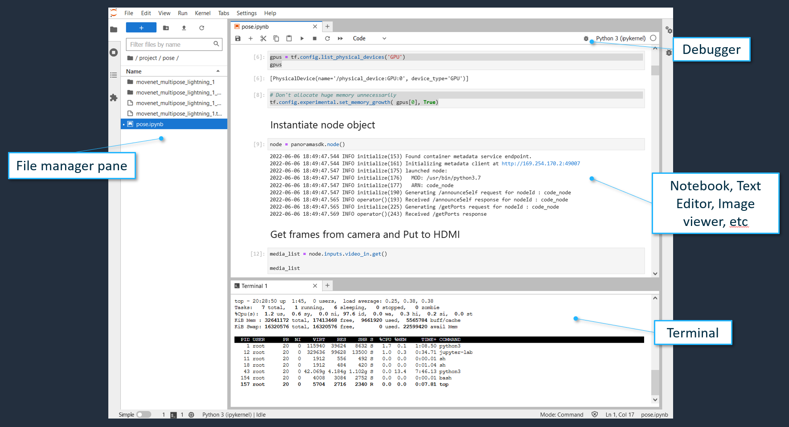
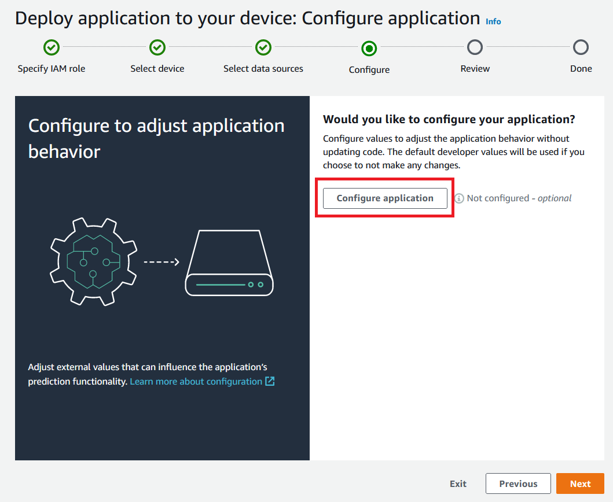
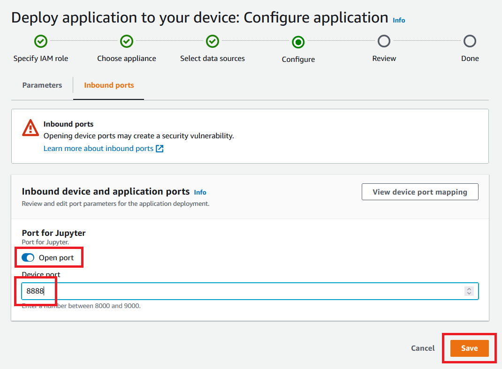

## Overview

**PanoJupyter** is a Panorama application which launches **JupyterLab on Panorama appliance device**. You can quickly prototype Panorama application with a real device.



## Features

* **Quickly iterate** prototyping of Panorama applications by editting and running notebooks on Panorama appliance devices **interactively**.
* Open **Terminal window** within the JupyterLab, and run **shell commands**.(Still within the container.)
* Drag & Drop to **upload files** (Python source files, model data files, configuration files, etc), and **download files** (Updated notebooks, captured images, etc) from the file manager pane.
* **Preview images** (camera images and rendering results) on notebooks, by using matplotlib.pyplot.
* Apply **Python profiler** (cProfile module) to find performance bottleneck in your application.
* Enable **Python debugger**, and use debugger features such as break points, step executions, inspecting variables, etc.


## Security notice

* > We do not recommend doing this on a production system because this creates a security vulnerability and might disrupt the normal operation of your device.
* > Opening a port to create a webserver could but doesn't necessarily create a security vulnerability and you will be relying on the security of the downloaded environment to protect your development environment.


## How to build

1. Prepare a Panorama application development environment on ARM-EC2 instance if you don't have. You can create it by following [Test Utility environment setup](https://github.com/aws-samples/aws-panorama-samples/blob/pano_jupyter/docs/EnvironmentSetup.md) document.
1. SSH to ARM-EC2 instance.
1. Check out latest revision of this sample repository (https://github.com/aws-samples/aws-panorama-samples).
1. Change directory to "aws-panorama-samples/tools/pano_jupyter/src/pano_jupyter_\*".
    * **Note** : There will be multiple variations of PanoJupyter applications for different frameworks. But currently only TensorFlow one is available (suffix : `_tf`).
1. Run "panorama-cli import-application".
1. For pano_jupyter_tf, download [TF37_opengpu sample dependency file](https://panorama-starter-kit.s3.amazonaws.com/public/v2/opengpusamples/TF_Sample/dependencies.zip) , extract it, and copy "tensorflow-2.4.4-cp37-cp37m-linux_aarch64.whl" to "./packages/{your-account-id}-pano_jupyter_tf_code-1.0/".
1. (Optional) If you want to install additional libraries in the PanoJupyter, apply your changes in the Dockerfile under "packages/{account-id}-pano_jupyter_\*_code-1.0/".
1. Run "panorama-cli build-container --container-asset-name code --package-path packages/{your-account-id}-pano_jupyter_\*_code-1.0".
1. Create a Zip file of the application.
    ``` bash
    cd ./src
    python3 archive.py pano_jupyter_tf
    ```


## How to use

1. Choose your preferred deep learning framework. Make sure you have built the application in "How to build" section above.
1. Extract the Zip file.
1. Under the "pano_jupyter_\*/" directory, run "panorama-cli import-application" command.
1. Run "panorama-cli package-application" command.
1. Deploy the pano_jupyter_\* app onto device.
    * Option 1 (basic) : Deploy using Management Console UI.
        1. At the "Configure" step in the deployment wizard, click the "Configure application" button. 
        1. Choose "Inbound ports" tab. 
        1. Enable "Open port", configure "Device port" (default: 8888), and "Save" 
    * Option 2 (advanced) : Deploy using AWSCLI or API. 
        1. This Edit the override manifest file "pano_jupyter_\*/graphs/pano_jupyter_\*/override.json", include cameras you want to use, and specify the inbound network port.
        1. Deploy pano_jupyter_\* programmatically using boto3's create_application_instance() API or AWSCLI's "aws panorama create-application-instance" command. Specify contents of graph.json as the manifest payload, and contents of override.json as the override manifest payload. (See also : [CLI document](https://docs.aws.amazon.com/cli/latest/reference/panorama/create-application-instance.html), [Boto3 document](https://boto3.amazonaws.com/v1/documentation/api/latest/reference/services/panorama.html#Panorama.Client.create_application_instance)).
1. Confirm the completion of deployment.
    * **Note** : After the deployment completed, you will see `Error` or `Not available` status. You can safely ignore these errors. It just means the application hasn't started regular computer vision process yet.
1. Identify the IP address of your appliance device. You can use the Management Console UI or "aws panorama describe-device" command.
1. Check "console_output" log stream on CloudWatch Logs, identify the Jupyter server's security token, and copy to your clipboard. This part : http://127.0.0.1:8888/lab?token=`{token}`
1. Open "http://{ip-address-of-appliance}:{port-number}/" with your browser. Port number is what you specified as the Inbound networking port (default : 8888). If security token is asked, use the one you got from the "console_output".
1. Write and run your notebooks. You can Drag & drop "notebook/pose_\*.ipynb" as a sample notebook how to interactively prototype Panorama applications.


## Limitations

* Your Panorama appliance device and your development host machine have to be in a sample network, as your browser needs to access your Panorama appliance device.
* If you reset Jupyter kernel and instantiate panoramasdk.node objects multiple times, panoramasdk APIs don't work as expected. You need to restart the device to clean start the pano_jupyter application. As a known issue, layoyt of HDMI output will break if you create panoramasdk.node instances multiple times without restarting.
* You cannot install additional native libraries once PanoJupyter is deployed. All the native libaries have to be included in the code container image before deployment. Please refer to the "How to build" section above.
