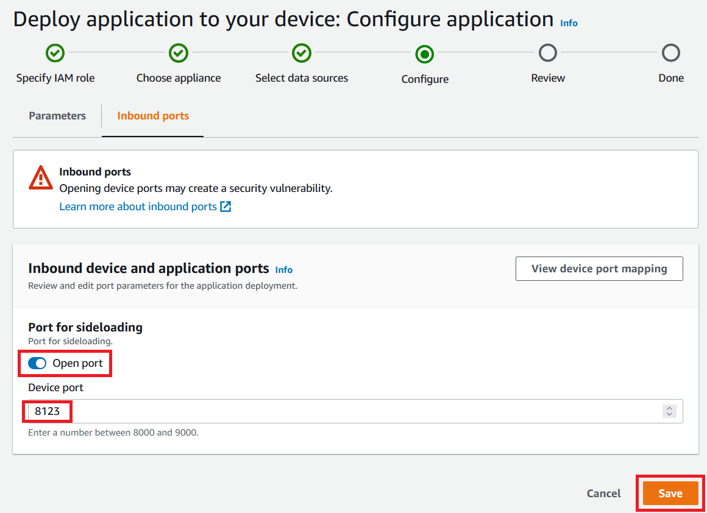

## Overview

**Sideloading** tool is a sample solution to add side-loading capability to your Panorama application. With this solution, you can modify scripts & models, transfer them to the device, and run the updated scripts without re-deploying the entire application. It gives you quicker development iteration experience.

This solution comes with 1) sideloading agent module you can import in your Panorama application, 2) sideloading commandline interface you can use on your development host.

## Features

* Automatically identify updated files and transfer them. (**"sync" command**)
* Run the updated scripts and models as a process. (**"run-app" command**)
* Kill the process. (**"kill-app" command**)
* Easily switch the application from side-loading enabled development mode to production mode, with single line of code change.


## Security notice

* > We do not recommend doing this on a production system because this creates a security vulnerability and might disrupt the normal operation of your device.
* > Opening a port to create a webserver could but doesn't necessarily create a security vulnerability and you will be relying on the security of the downloaded environment to protect your development environment.


## How to use

1. Under the top directory of your application (where assets / graphs / packages directory exist), run the "install.py" script to generate and install necessary files.

    ``` bash
    python3 aws-panorama-samples/tools/sideloading/install.py --expiry 30 --app-src-dir ./packages/123456789012-code-1.0/src
    ```

    This script creates / installs following files.

    * `sideloading_agent.py` under code package src directory.
    * `sideloading_server.cert.pem`, `sideloading_server.key.pem`, `sideloading_client.cert.pem` under code package src directory.
    * `sideloading_client.cert.pem`, `sideloading_client.key.pem`, `sideloading_server.cert.pem` under current directory.

    **Important:** Generated PEM files are used for authentication between Sideloading agent and Sideloading CLI. Please keep the them secure, and don't share them widely.

    **Important:** In the example above, expiry of certificate files is set 30 days ("--expiry 30"). This parameter is configurable, but please use minimum necessary length of expiry, and avoid using unncessary long expiry.


1. Modify your Panorama application entry point script (e.g. "app.py") as follows:
    ``` python
    import sideloading_agent

    sideloading_agent.run(
        enable_sideloading = True,
        run_app_immediately = False,
        port = 8123,
    )
    ```

1. Enable inbound networking by modifying JSON files as follows.
    - Add "inboundPorts" element at the following place in the code package.json.
        ``` json
        {
            "nodePackage": {
                "interfaces": [
                    {
                        "network": {
                            "inboundPorts": [
                                {
                                    "port": 8123,
                                    "description": "sideloading"
                                }
                            ]
                        }
                    }
                ]
            }
        }
        ```

    - Add "networkRoutingRules" element at the following place in manifest file.
        ``` json
        {
            "nodeGraph": {
                "networkRoutingRules": [
                    {
                        "node": "code_node",
                        "containerPort": 8123,
                        "hostPort": 8123,
                        "decorator": {
                            "title": "Port for sideloading",
                            "description": "Port for sideloading."
                        }
                    }
                ]
            }
        }
        ```
1. With regular panorama application building & packaging steps, build and package the side liading enabled application. (`panorama-cli build-container` command, `panorama-cli package-application` command).

1. Deploy the application onto your device.
    * Option 1 (basic) : Deploy using Management Console UI.
        1. At the "Configure" step in the deployment wizard, click the "Configure application" button. 
        1. Choose "Inbound ports" tab. 
        1. Enable "Open port", configure "Device port" (default: 8123), and "Save" 
    * Option 2 (advanced) : Deploy using AWSCLI or API.
        1. Include the "networkRoutingRules" element in the override manifest file as well.
            ``` json
            {
                "nodeGraphOverrides":{
                    "networkRoutingRules":[
                        {
                            "node": "code_node",
                            "containerPort": 8123,
                            "hostPort": 8123
                        }
                    ]
                }
            }
            ```
        1. Deploy pano_jupyter_\* programmatically using boto3's create_application_instance() API or AWSCLI's "aws panorama create-application-instance" command. Specify contents of graph.json as the manifest payload, and contents of override.json as the override manifest payload. (See also : [CLI document](https://docs.aws.amazon.com/cli/latest/reference/panorama/create-application-instance.html), [Boto3 document](https://boto3.amazonaws.com/v1/documentation/api/latest/reference/services/panorama.html#Panorama.Client.create_application_instance)).

1. Confirm the completion of deployment.
    * **Note** : After the deployment completed, you will see `Error` or `Not available` status. You can safely ignore these errors. It just means the application hasn't started regular computer vision process yet.

1. Check "console_output" log stream on CloudWatch Logs, and confirm "SideloadingAgent started" message.

1. Identify the IP address of your appliance device. You can use the Management Console UI or "aws panorama describe-device" command.

1. Under the top directory of your application (where assets / graphs / packages directory exist), hit "`sideloading_cli.py sync`" command to transfer updated files. Following is an example:

    ```bash
    $ python3 aws-panorama-samples/tools/sideloading/sideloading_cli.py sync --addr 10.0.0.245 --port 8123 --src-top packages/123456789012-mycode-1.0/src
    ```

    **Note:** This is an example. Please replace script path, IP address of the device, port number, and path to the "src" directory according to your environment.

1. Under the top directory of your application (where assets / graphs / packages directory exist), hit "`sideloading_cli.py run-app`" command to run application with transfered files. Following is an example:

    ```bash
    $ python3 aws-panorama-samples/tools/sideloading/sideloading_cli.py run-app --addr 10.0.0.245 --port 8123
    ```

1. Reboot the device, and repeat "sync" and "run-app".


## How to switch to Production mode

When you completed the development and are ready to deploy to production system, please take following steps.

1. Modify your Panorama application entry point script (e.g. "app.py") as follows:
    ``` python
    import sideloading_agent

    sideloading_agent.run(
        enable_sideloading = False,
        run_app_immediately = True,
    )
    ```
1. With regular panorama application building & packaging steps.
1. Deploy the application onto your device without enabling inbound networking port. (keep the "Open port" checkbox disabled when deploying.)


## How it works

1. Transfered files are stored under `/opt/aws/panorama/storage/sideloaded/`. This is a different directory from Panorama application's standard application directory - `/panorama/`.

1. `run-app` command tries to find application script in the following priority order. The first script found is executed as a child process.

    1. `/opt/aws/panorama/storage/sideloaded/main.sh`
    1. `/opt/aws/panorama/storage/sideloaded/main.py`
    1. `/panorama/main.sh`
    1. `/panorama/main.py`

1. When running the child process, current working directory of the process is set at the directory of the script found - `/opt/aws/panorama/storage/sideloaded/` or `/panorama/`. This is different from Panorama applications' standard behavior where working directory is set at `"/"` (root directory). In order for your application to accesses sideloaded files, you can use relative paths such as "./config.json". If you use absolute paths such as "/panorama/config.json", it doesn't refer to sideloaded files.


## Limitations

* Your Panorama appliance device and your development host machine have to be in a same network, as sideloading_cli.py needs to access your Panorama appliance device.
* panoramasdk.node instance is intended to be created just once within a lifetime of Panorama application. If you use run-app command and kill-app command and create `panoramasdk.node` instances multiple times as a result, the behavior of panoramasdk.node APIs is indeterministic. Please reboot the device in this case.
* You cannot sideload native libraries. All the native libaries have to be included in the code container image before deployment.
